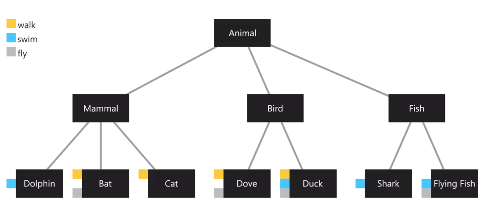

# 多重继承
大家都知道 C++ 的多重继承：一个类可以将多个类作为其父类。

但是多重继承会引发很多的问题：

1. 结构复杂化：如果是单一继承，一个类的父类是什么，父类的父类是什么，都很明确，因为只有单一的继承关系，然而如果是多重继承的话，一个类有多个父类，这些父类又有自己的父类，那么类之间的关系就很复杂了。

2. 优先顺序模糊：假如我有A，C类同时继承了基类，B类继承了A类，然后D类又同时继承了B和C类，所以D类继承父类的方法的顺序应该是D、B、A、C还是D、B、C、A，或者是其他的顺序，很不明确。

3. 功能冲突：因为多重继承有多个父类，所以当不同的父类中有相同的方法是就会产生冲突。如果B类和C类同时又有相同的方法时，D继承的是哪个方法就不明确了，因为存在两种可能性。

现代语言一般都是单继承形态（Java，Swift，Kotlin 等等）。但是很多时候又需要多继承，如下示例：



我们这里有一个名为Animal的超类，它有三个子类（Mammal，Bird和Fish）。在底部，我们有具体的一些子类。小方块代表行为。例如，蓝色方块表示具有此行为的类的实例可以swim。

有些动物有共同的行为：猫和鸽子都可以行走，但是猫不能飞（除了Nyan Cat😀）。这些行为与此分类正交，因此我们无法在超类中实现这些行为。

如果一个类可以拥有多个超类，那就很容易办到了。我们可以创建另外三个类：Walker，Swimmer，Flyer。在那之后，我们只需从Walker类继承Dove和Cat。但在Dart中，每个类（除了Object类）都只有一个超类。

我们可以实现它，而不是继承自Walker类，因为它是一个接口，但我们必须在多个类中实现行为，因此它并不是一个好的解决方案。

# Mixin
Mixin的出现就是为了解决多重继承的问题。我们可以在众多语言中看到其身影。

在 Java 中叫 interface（Java8中可以有接口默认方法）。

在 Swift 中叫 Protocol (可以有默认方法)。

在 Dart 中叫 Mixin (可以有默认方法)。

一个 Demo：
```
mixin PlatformMixin {
  Widget build(BuildContext context) { 
    return null;
  }
}

```


