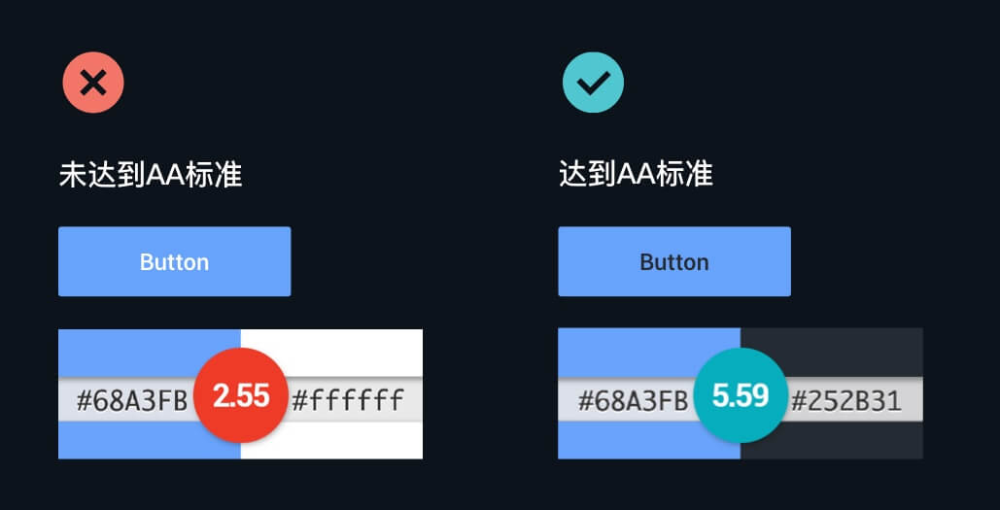

---
layout: post
title: "暗黑模式在 Trip.com App上的实践"
author: "Damien"
tags:
    - iOS
    - Android
    - React Native
    - 产品设计
    - 暗黑模式
--- 


# 暗黑模式在 Trip.com App上的实践


## 背景
在 2019 年，随着 iOS 13 与 Android Q 的推出，Apple 和 Google 同时推出主打功能暗黑模式，分别为 Dark Mode(iOS)/Dark Theme(Android) ，下文我们统称为 Dark Theme。在前期预研中，我们发现 66% 的 iOS 13 用户选择打开Dark Theme，可见用户对暗黑模式的喜爱和期待。

那么 Dark Theme 能带来哪些好处呢？
* 更加省电 当代手机大部分都是OLED屏（OLED屏黑色下不发光更省电），配合Dark Theme 能耗更低；
* 提供一致性的用户体验 当用户从Dark Theme的环境切换到我们的App，仍然能够享受黑色的宁静，避免亮眼的白色带来的刺激感；
* 提升品牌形象 及时跟进系统新特性，在享受新特性带来美好之外还能获得Apple Store和Google Play推荐位机会，提升整体品牌形象；
* 为弱视以及对强光敏感的用户提高可视性，让用户在暗环境中轻松使用App。

接下来，我们从视觉设计、实现方案和开发效率三个角度来介绍 Dark Theme 在 Trip.com App的实践。
## 视觉设计
暗黑模式是一套全新的设计风格，非简单的颜色明暗处理。我们将设计理念归结为三大要点，并介绍我们整体的设计思路。
### 三大要点
#### 1、元素层级越高，表面颜色越浅
UI视觉层次致力于以一种用户能够快速理解的方式呈现产品内容，那么在 Dark Theme 下如何保证视觉层级依然有效呢？在 Light 模式中，我们使用带投影的白色卡片来模拟现实世界的空间深度感，而切换到 Dark 模式，则需要通过较浅的颜色表面来表示高度。层级越高，越接近于光源，表面的颜色就越浅。


#### 2、降低饱和度，提升可读性
设计 Dark Theme 时，尽量避免使用高饱和度的颜色，因为这些颜色会在深色背景上产生视觉抖动，导致人眼产生疲劳。以 Trip.com 的品牌蓝为例，若颜色不做调整，直接展示在深色背景上，不仅信息的清晰度降低了，而且识别的费力度还增高了。这显然不是我们所希望的，所以在 Dark Theme 下我们选择更低饱和的颜色来达到更好的可读性。


#### 3、增加对比度，提升可用性
依据 WCAG2.0 AA 设计标准，文本的视觉呈现以及文本图像至少要有4.5:1的对比度。深色表面选取白色文字达不到 AA 标准。


### 设计方案
遵循上述设计要点，我们制定了 Trip.com 的颜色映射和插画设计方案。

#### 颜色映射方案
为了规范化管理颜色库，保证产品、设计、开发的理解一致性，我们采用最直观的方式来命名颜色。这种方式既统一了 Light 和 Dark 的颜色命名，又降低了各方的沟通难度。具体的映射效果如下：

UI中的彩色，统一进行了降饱和处理，这些彩色会应用于不同的场景，可能是背景，行动点，标签，或者是图标等等地方，那么当彩色用于背景时，为了确保文字和背景色有足够对比度，低饱和度的浅色背景就需要配合深色字一起使用。


#### 插画系统的设计
开启 Dark Theme，就像是我们把房间的窗帘拉上了，打开了一盏灯，不同层级高度的物体表面会受到不同的光照，表现出不同明暗的颜色。我们插画系统中的物体和人物沿用这种设计，在暗环境中，由于光线不够充足，人物的肤色会跟着变暗，衣服的颜色也会发生微妙的变化。比如白色、鲜亮的衣服，到了暗环境下，就会呈现灰色、低饱和度的暗色。


## 实现方案
Trip.com App 使用原生系统与 React Native 混合开发的模式。我们在各系统方案的基础上，结合 Trip.com 自身的特性，制定了一套iOS、Android和React Native三端的Dark Theme适配方案。

### iOS
我们为 iOS 13 以上用户提供了两种主题模式的选择：
- 自适应模式：跟随系统展示 Light/Dark 主题
- 强制 Light 模式：App 保持 Light 主题，不随系统主题变化

#### 适配原理
iOS系统为 UIWindow、UIViewController、UIView 提供了overrideUserInterfaceStyle 属性来控制 Light/Dark 主题，所以我们只要控制 KeyWindow 的该属性，就可以控制整个 App 的主题。
适配方案
#### 1、设置开关

App主题设置逻辑如图，KeyWindow 只有在App和系统都开启 Dark Theme 时，才会开启 Dark 主题。
跟随系统切换主题需要考虑到 App 运行时，系统主题被切换的情况：
前往系统设置页手动切换
开启自动切换后，系统会自动更新主题
这两种情况都需 App 进入后台，所以只需要添加 App 进入前台的监听，重复1的逻辑即可完成跟随系统变换主题的功能
#### 2、颜色适配

系统提供了 colorWithDynamicProvider 方法来适配 Light/Dark 模式下的颜色，我们依照视觉颜色映射方案封装颜色，覆盖绝大多数场景。部分无法通过动态色适配的场景，如 CGColor、RGB 颜色，可以通过 resolvedColorWithTraitCollection 方法解析出当前上下文所需要的颜色进行使用。

#### 3、图片适配

系统早在 iOS12 就为 UITraitCollection 增加了 userInterface 属性，我们只要向 ImageAssets 注册 Light/Dark 下两种主题的图片，而后 UIImageView 根据 traitCollectionDidChange 变化自动获取 Light/Dark 图片。
App 内的静态图片资源可以通过 Images.xcassets 直接配置，通过网络下发或代码动态生成的图片可以通过 registerImage:withTraitCollection: 的方式进行动态注册。
#### 注意事项
动态色或 ImageAssets 的原理都是根据容器的 userInterface 取得对应的内容，视图上的动态颜色或 ImageAssets 将根据视图的 userInterface 取值，App 内直接进行颜色计算或者图片处理的将会根据 UITraitCollection.currentColletion 进行取值。

设置 Window 的主题来完成 App 主题适配的工作，会存在 App 主题与系统主题不同步的情况，例如系统主题为 Dark，App 主题为 Light。此时直接对动态颜色或 ImageAssets 进行操作会取得错误的结果，所以对于这种场景，都不使用动态色或 ImageAssets，仅在发生主题切换时机进行视图刷新操作。

### Android
我们不仅在 Android Q 上实现 Dark Theme，在 Android Q 以下的版本也适配了 Dark Theme。
在 Android Q 上，用户可以选择跟随系统来展示 Dark Theme 或者强制关闭 Dark 保持 Light 主题。
在 Android Q 以下，我们也支持了 Dark Theme，用户可以选择强制打开或者强制关闭 Dark Theme。
#### 适配原理
Android App 启动时会根据系统的配置加载不同的资源，以加载图片为例，高分辨率系统加载三倍图，低分辨率系统加载二倍图。同样地，系统也会根据 Dark Theme 的打开或者关闭来加载 Dark 或者 Light 资源。

我们会往 App 的 value 和 value-night 文件目录下放置 UED 提供的 Light 和 Dark 两套资源。当 App 打开 Dark Theme，系统选择从 value-night 目录加载资源，展示 Dark 界面；当 App 关闭 Dark Theme，系统选择从 value 目录加载资源，展示 Light 界面。

#### 适配方案
我们通过开关设置、颜色适配、图片适配和其他注意事项四小节来介绍Android的Dark Theme适配方案。


#### 1、开关设置

从上述代码可以看出，只有使用 AppCompat 的代码才具有 Dark Theme 特性，例如继承 AppCompatAcivity 和 AppCompatDialog 才支持 Dark Theme，而普通的 Activity 和 Dialog 不会展示 Dark Theme，同样地 Application 也不支持。
```java
// 打开darkmode 
AppCompatDelegate.setDefaultNightMode(AppCompatDelegate.MODE_NIGHT_YES);

// 关闭darkmode
AppCompatDelegate.setDefaultNightMode(AppCompatDelegate.MODE_NIGHT_NO);

// darkmode跟随系统
AppCompatDelegate.setDefaultNightMode(AppCompatDelegate.MODE_NIGHT_FOLLOW_SYSTEM);
```

#### 2、颜色适配
在 value 和 value-night 目录下定义 Light 和 Dark 相同名字的颜色，如下图

在 XML 或者代码中使用
```java
//xml
android:textColor="@color/color_branding_blue" 

//Java kotlin
ContextCompat.getColor(activity, R.color.color_branding_blue)
```

注意：Activity 必须是 AppCompatActivity 实例，不能是 ApplicationContext/Activity
另外由于带透明度的颜色必须一个一个在 XML 声明，为了减轻开发工作量，我们提供了一个脚本可以快速生成 Light 和 Dark 下的透明度颜色。

#### 3、图片适配
图片适配工做分资源图片适配和自定义 drawable 适配：

- drawable/mipmap：在 drawable-xxhdpi 和 drawable-night-xxhdpi 目录下放置Light和Dark相同名字的图片，系统根据Light/Dark加载图片。
- IconFont/自定义Shape/自定义Selector/SVG：因为绘制使用颜色，所以用法同颜色。

#### 4、其他注意事项
- 在非 AppCompatActivity 内展示 Dark Theme
  利用下面的代码可在非 AppCompatActivity 内展示 Dark 颜色
  
```java
public class IBUDarkModeDelegate {

    public static void applyNight(Context activity) {
          Activity conreteActivity = null;
          if (activity instanceof Activity) {
              conreteActivity = (Activity) activity;
          } else if (activity instanceof ThemedReactContext) {
              conreteActivity = (Activity) ((ThemedReactContext) activity).getBaseContext();
          }
          if (conreteActivity != null) {
              AppCompatDelegate appCompatDelegate = AppCompatDelegate.create(conreteActivity, new AppCompatCallback() {
                  public ActionMode onWindowStartingSupportActionMode(ActionMode.Callback callback) {
                      return null;
                  }
              });
              appCompatDelegate.applyDayNight();
          }
    }
}

// Activity创建前调用即可 
protected void onCreate(Bundle savedInstanceState) {
    IBUDarkModeDelegate.applyNight(this);
    super.onCreate(savedInstanceState);
}
```

- 颜色名必须全App唯一。
- 切换手机系统的Dark Theme，会导致Activity重建，业务线按需做好状态保存恢复。
- 做好全机型测试，防止个别机型出现异常展示问题。

### ReactNative
#### 适配方案
RN 桥接 Native 端，通过直接获取和动态监听两种方式获取 Native 端的主题变化。
#### 从 Native 端获取当前的 theme 值
使用 Native Modules 的同步方法在 JS 端获取当前 theme 值,JS 端方法调用能直接得到 Native 同步方法的返回值，而非一个 Promise。
同步方法于 2017 年 1 月和 10 月先后被引入 ReactNative 的 Android 端和 iOS 端， 但直到现在，仍然没有被写入文档：

 - iOS: 使用 RCT_EXPORT_SYNCHRONOUS_TYPED_METHOD()  替换  RCT_EXPORT_METHOD()(v0.51.0 及以上版本支持[Commit](https://github.com/facebook/react-native/commit/47bfbbb1d3f2b67c053d31d9ed79ec3c50a127cf))
    
- Android: 在 @ReactMethod annotation 后面添加  (isBlockingSynchronousMethod = true) (v0.42.0 及以上版本支持[Commit](https://github.com/facebook/react-native/commit/59226f022cf985e104a574ee2859e920ff9aa4b6))

同步方法的缺点是无法在 Debug Remotely 时调用，所以必须在 Debug Remotely 时，提供默认值。我们接入 dark theme 时，选择了 dark 作为默认值。
#### theme 值变化监听 
我们使用RN事件监听Theme变化。

 - iOS: [RCTEventEmitter](https://reactnative.dev/docs/native-modules-ios#sending-events-to-javascript)
 - Android: [RCTDeviceEventEmitter](https://reactnative.dev/docs/native-modules-android#sending-events-to-javascript)
 
#### RN业务方调用 theme 
我们提供 IBUThemeContext  &  IBUThemeProvider 两个类供产线获取主题。 [Context](https://reactjs.org/docs/context.html) 提供了一个无需为每层组件手动添加 props，就能在组件树间进行数据传递的方法。 IBUThemeContext 是 Context 在 Theme 上的一个应用， IBUThemeProvider 负责同步 Theme 值，并将其传递给  IBUThemeContext.Provider。

```TypeScript
// IBUThemeContext
export const IBUThemeContext = React.createContext<'light' | 'dark'>('light');
//IBUThemeProvider
export class IBUThemeProvider extends Component<IBUThemeProviderProps, IBUThemeProviderState> {
  // 引入文件时同步获取一次 theme
  static theme: 'light' | 'dark' = isInChromeDebugMode ? 'dark' : IBUTheme.getTheme();
  constructor(props: IBUThemeProviderProps) {
    super(props);
      // 实例创建时, 再次同步一次theme
      const theme = isInChromeDebugMode ? 'dark' : IBUTheme.getTheme();
      IBUThemeProvider.theme = theme;
      this.state = {
        theme,
      };
 }
  render(): JSX.Element {
    const { theme } = this.state;
    const { children } = this.props;
    return <IBUThemeContext.Provider value={theme}>{children}</IBUThemeContext.Provider>;
  }
}
```
将IBUThemeProvider 嵌入App 的根节点， 组件树便能通过如下两种方法,获取theme值:
通过IBUThemeProvider.theme 读取全局theme
声明了static contextType=IBUThemeContext, 的类中使用 this.context, 获取theme值

#### 颜色适配

我们提供下列方法供产线使用颜色, 方法支持透明度的设置:
```TypeScript
export declare class IBUColor{
  static red(theme?: 'light' | 'dark', alpha?: number): string;
  static green(theme?: 'light' | 'dark', alpha?: number): string;
  static blue(theme?: 'light' | 'dark', alpha?: number): string;
}
```

所有方法均接受 theme 和 alpha 两个可选参数，
方法会先根据 theme 选择对应颜色的 hex 字符串色值，如果 theme 值为空， 则 fallback 到 IBUThemeProvider.theme ，
之后再根据 alpha 值计算颜色的的 alpha hex 值，并拼接到 hex 字符串色值之后。如 alpha 为空，则不拼接 hex 色值。
最后将对应的 hex 色值字符串返回。

#### 图片适配
我们使用 lazy getters 解决 Light/Dark 图片展示的问题。方式如下：
RN端图片之前已经作了统一的静态资源管理:

```JavaScript
export const images = {
  button: require('./images/button.png'),
  logo: require('./images/logo.png'),
}
```

使用 lazy getters， 稍作改造后，即能完美适配:

```JavaScript
export const images = {
  get button() {
    const theme = IBUThemeProvider.theme;
    return theme === 'dark' ? require('./images/button_dark.png') : require('./images/button.png');
  },
  get logo() {
    const theme = IBUThemeProvider.theme;
    return theme === 'dark' ? require('./images/logo_dark.png') : require('./images/logo.png');
  }
}
```


#### DynamicStyle

ReactNative 导出的 StyleSheet 只会在文件引入时，初始化一次，不会随着 App DarkTheme 的变化而变化这就导致系统主题发生变化时，RN 无法更新 styles，导致 RN 页面与 Native 不一致的问题。
为此我们提出 DynamicStyleSheet 来解决该问题

```TypeScript
type IBUNamedStyles<T> = { [P in keyof T]: ViewStyle | TextStyle | ImageStyle };
export function IBUDynamicStyleSheet<T extends IBUNamedStyles<T> | IBUNamedStyles<any>>(
  callback: () => T | IBUNamedStyles<T>
): (theme?: 'light' | 'dark') => T {
  const cache: { light?: T; dark?: T } = {
    light: undefined,
    dark: undefined,
  };
  return (theme?: 'light' | 'dark'): T => {
    const currentTheme = theme || IBUThemeProvider.theme;
    let style = cache[currentTheme];
    if (!style) {
      style = StyleSheet.create(callback());
      cache[currentTheme] = style;
    }
    return style;
  };
}
```

 IBUDynamicStyleSheet  是一个 Function，它接受一个返回值是 style 的 Function 作为参数，并且返回一个 Function。
这种 Function 也被称[High Order Function](https://www.oreilly.com/library/view/functional-javascript/9781449360757/ch04.html).
StyleSheet 创建 style 的代码被包在参数的 Function 中，这样可以保证每次取值都会取到当前的  theme  对应的 style。
每次 render 前, 将返回的 Function 执行一次，并将这个 Function 的返回值作为真正的 style 使用。
 IBUDynamicStyleSheet 内部对 light 和 dark 下的 style 作了缓存，这样大部分情况下 style 仍然只会被创建一次， theme  发生变化时 style 被创建两次， theme  发生多次变化时，style 最多只被创建两次。

采用DynamicStyleSheet这种方式，代码改动量不仅小， 而且性能损失少， 达到实时切换Theme的目的。
#### Examples
App 开启dark theme
```JavaScript
export default class App extends Component{
  render(){
    return (
      <IBUThemeProvider>
        // ...
      </IBUThemeProvider>
    )
  }
}
```

Class Component 接入

```JavaScript
class MyClass extends React.Component {
  //需要声明contextType, 否则该组件可能不会随theme变化而重新绘制
  static contextType = IBUThemeContext;

  constructor(props, context) {
    super(props, context)
    // context can be accessed now, https://github.com/facebook/react/issues/6598
    const theme = this.context;
    // ....
  }
  // ...
  render() {
    const theme = this.context; // 'light'|'dark'
    /* render something based on the value of IBUThemeContext */
    const styles = dynamicStyles(theme);
    return(
      <View style={{ backgroundColor: IBUColor.orange(theme), flex: 1 }}>
        <View style={styles.icon}/>
        {/* render something else */}
      </View>
    )
  }
}
const dynamicStyles = IBUDynamicStyleSheet(() => ({
  icon: {
    backgroundColor: IBUColor.quaternaryGray(),
    height: 20,
  },
}));
```
Functional Component接入

```JavaScript
export const MyComponent = () => {
  const theme = React.useContext(IBUThemeContext);  // 'light'|'dark'
  const styles = dynamicStyles(theme);
  return (
    <View style={{ backgroundColor: IBUColor.orange(theme), flex: 1 }}>
        <View style={styles.icon}/>
        {/* render something else */}
    </View>
  )
}
const dynamicStyles = IBUDynamicStyleSheet(() => ({
  icon: {
    backgroundColor: IBUColor.quaternaryGray(),
    height: 20,
  },
}));
```

注意：Component必须声明contextType, 否则不能在theme发生变化时触发render重绘。
## 工具&效率
在建立颜色规范到方案落地的过程中，我们发现新的颜色命名虽然容易理解，由于对使用的名字命名，开发在使用时需要对照视觉稿查找对应的颜色命名，造成开发效率上的浪费。
例如视觉稿上显示 #287DFA，开发根据色值查找此颜色的映射名称 brandingBlue，再将颜色设置成 brandingBlue。
为了解决此问题，我们扩展了 Sketch Measure 插件，颜色一栏不再展示颜色的色值，取而代之的是颜色的命名。这样开发能依照视觉稿直接获取颜色名，大大减少工作量。
插件效果如下

至此完美解决了开发适配 Dark Theme 的效率问题。

## 结语
Dark Theme适配是一项涉及多职能部门合作的庞大项目。在规范的设计指导、完善的落地方案和便捷的效率工具加持下，我们的适配成本和资源大大降低。在各端仅投入一位研发人员的情况下，我们在二周内完成了从方案制定到方案落地，并推进产线接入。

Trip.com一直致力于追随前沿新特性，带给用户最好的体验，让用户更舒适，旅行从此简单。

## 参考资料
Apple Dark Mode介绍：
https://developer.apple.com/design/human-interface-guidelines/ios/visual-design/dark-mode/
Implementing Dark Mode on iOS - WWDC2019：
https://developer.apple.com/videos/play/wwdc2019/214/
Android Dark Theme 介绍：
https://developer.android.com/guide/topics/ui/look-and-feel/darktheme
React Native 参考：
https://github.com/react-native-community/discussions-and-proposals/pull/11#discussion_r210370835
https://github.com/facebook/react-native/commit/63fa3f21c5ab308def450bffb22054241a8842ef#diff-55c2992d993407398c62bf19f803088f
https://github.com/Lxxyx/react-native-dynamic-stylesheet
https://developer.mozilla.org/en-US/docs/Web/JavaScript/Reference/Functions/get
https://medium.com/fantageek/how-to-structure-your-project-and-manage-static-resources-in-react-native-6f4cfc947d92
https://willowtreeapps.com/ideas/react-native-tips-and-tricks-2-0-managing-static-assets-with-absolute-paths
WCAG21视觉标准：
https://www.w3.org/TR/WCAG21/#contrast-enhanced


